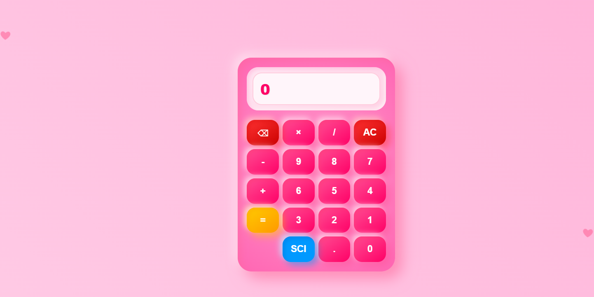
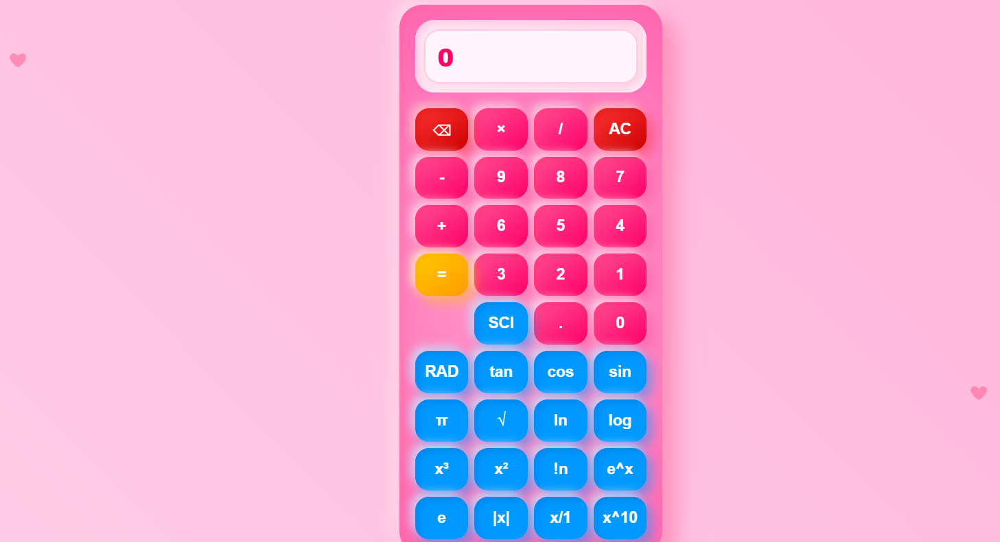
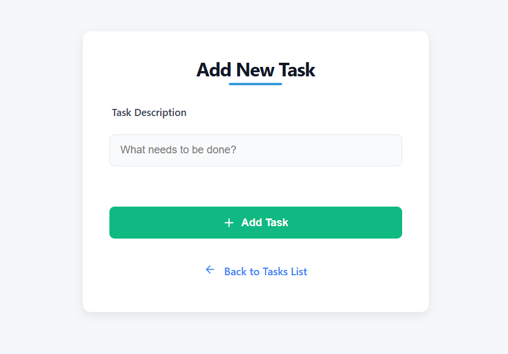

# 🧮 Calculator

A simple calculator app built with HTML, CSS, and JavaScript.  
This project is ideal for beginners who want to understand the fundamentals of DOM manipulation and basic arithmetic logic in JavaScript.

<div align="center">
  
  
</div>

---

## 🚀 Features

- Basic arithmetic operations: addition, subtraction, multiplication, division  
- Clean and responsive user interface  
- Button click and keyboard input support  
- Real-time display updates

---

## 🖼️ Preview






---

## 🛠️ Technologies Used

- **HTML5** – Markup structure  
- **CSS3** – Styling and layout  
- **JavaScript** – Calculator logic and DOM handling

---

## 📁 Project Structure

```text 
calculator/
│
├── index.html # Main HTML page
├── style.css  # CSS styles
└── script.js  # JavaScript logic
```

---

## ▶️ How to Use

1. Clone this repository:
   ```bash
   git clone https://github.com/VIDAKHOSHPEY22/calculator.git

2. Open the index.html file in your web browser:

open index.html

or simply double-click the file.


---

📚 Learning Purpose

This project was created for practicing front-end skills and JavaScript basics.
It's a great example for beginners who want to build functional UI applications.


---

🙋‍♀️ Author

Made with by Vida Khoshpey
Collaboration with Yalda Khoshpey


---

📄 License

This project is licensed under the MIT License - see the LICENSE file for details.

---
